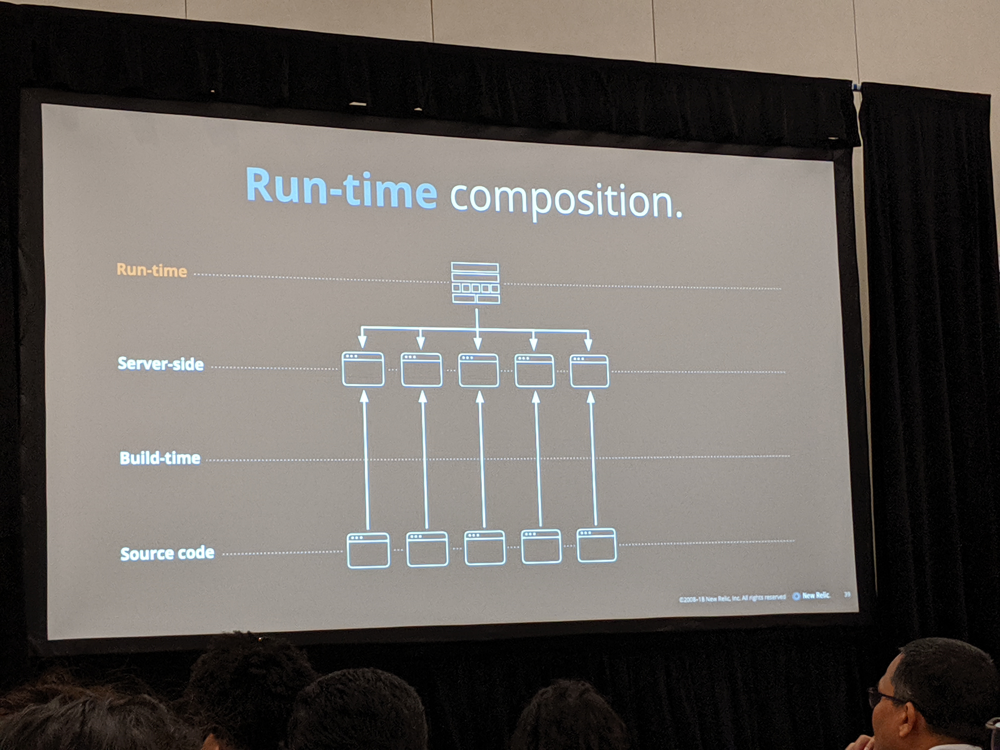

# Micro Frontend Architecture
- Building an extensible UI platform

## Erik Grijzen
- @ErikGrijzen
- Lead Software Engineer at New Relic
- Platform UI, Barcelona, Spain

## Notes
### Overview
- Why - why did we adopt a Micro Frontend Architecture?
- What? - What are micro frontends? What architecture decisions have we made?
- How? - How did we implement this architecture?

### Why
- 10 years ago, NR came to the market with a product called APM - Application Performance Monitoring
  - APM was one monolithic application. One DB, one app
  - Organization was still small so it worked fine
- As the company grew, we added more and more products
- As more products were added, they ran into typical monolithic problems
  - Cross communication between teams
  - Big app was hard to release, hard to understand
  - teams weren't autonomous which created a lot of friction
  - Crossing dependencies
- NR started dismantling the backend into microservices
  - One API gateway that talked to many microservice API's that each had their own DB
  - Each product was separated into it's own single page application and they were linked through the navigation menu
  - This worked much better, until about 2 years ago

- Many problems with the above approach:
  - UX Consistency
    - A more connected and unified user experience
    - Each single page app had their own tiny differences, despite the developers' best efforts to use shared components
    - This was confusing to the users
  - Extensibility
    - Allow customers to extend the products
    - As the company grew, clients had special use cases that became harder to manage
  - Remove boilerplate
    - avoid reinventing the wheels and focus on product innovation
    - all of the single page apps had the same basic code in them

- In comes New Relic One
  - Goals
    - easier and faster feature dev
    - more unified ui
    - better performance
    - more extensibility
- How can we scale our UI development?
  - Suddenly all teams have to work on the same product. How is that going to be scalable?

### What
- What is a micro front end?
  - "The idea behind Micro Frontends is to think about a website or web app as a composition of features which are owned by independent teams. Each team has a distinct area of business or mission it cares about and specializes in. A team is cross functional and develops... " - Micro front end architecture website
  - DB -> microservice -> API gateway -> micro front end -> application
  DB        DB        DB
    \         |         /
  Service   Service   Service
        \     |      /
          API Gateway
        /     |     \
  Micro UI  Micro UI  Micro UI

  - Bringing the concepts of microservices to UI development
- How can micro front ends help with easier and faster feature development?
  - independent deployments
  - cross functional teams
  - end-to-end implementation
  - full ownership and responsibility
  - allows parallel development
- Micro front ends should be small and decoupled
  - Loosely coupled
  - clear contracts
  - easier to reason about
  - easier to add, change, remove
  - easier to test
- Micro frontends should be business domain centric
  - Aligned with business structure
  - Highly specialized teams
- Removing boilerplate
  - Creating clear tech standards:
    - Provide good defaults
    - Easier to switch teams
    - innovate on platform level
  - Automating everything:
    - Project creation
    - build setup
    - continuous integration
    - continuous deployment
- Micro front ends should have a consistent UI/UX
  - Design system
  - Component libraries
    - owned by one team
      - Tried "it's owned by the whole company", but it didn't work
      - If everyone owns it, no one owns it.
      - Everyone only cares about the features they are responsible for
    - open for contributions
- Micro front ends should be performant
  - Shared rendering framework
    - It doesn't work to say that micro FE's should be tech-agnostic. Use one framework for all
  - Common dependencies
  - Deduplicate dependencies as much as possible

How to make one application?
- One approach: build time composition
  - Source code separated into multiple apps
  - Build time combines everything into one application
  - cons:
    - if you do an update to one micro front end, you have to release all of them again
- Another approach: server side composition
  - Source code and build time are separate UI's
  - Depending on the request from the client, the server will determine the app to serve
- Another approach: run-time composition
  - You have one container application
  - Based on the client side routing in the container app, you lazily load each application
  - This is the approach that New Relic took

### How?
- Created a CLI to create a new repo (called "Nerdpacks")
  - this sets up the entire front end structure for you
    - project structure
    - build setup
    - testing tools
    - deployment pipeline
  - Create MicroFrontends in these repos (called "Nerdlets")
    - One repo can have multiple micro front ends in a repository
    - Your team could care about multiple features within a domain, so there could be multiple apps since you're building "experiences"
- Once done, you publish the nerdlet via the CLI
  - This communicates with a "registry service" that puts things in the cloud and the DB
- Then you can deploy to a specific environment with the CLI

- Everything works *out of the box*.
  - No unit testing setup, no dependency configurations, no setup. Simply building features quickly

- There are other types of micro front ends
  - Nerdlet (which we already saw)
  - Launcher (applications)
    - These launch different views
  - Overlay (cross platform experiences)
    - can contain multiple nerdlets inside them
  - Entity types
    - Models, extensible pieces to add to any project
  - Hook (functions)
    - ex: multiple charts in their app. Each chart has an action button to perform more actions based on the hook
      - An add to dashboard hook allows the user to add it to some dashboard of theirs
      - This is important because they are extending EVERY chart that exists and every chart that will exist in the future
        - You can define where charts have these hooks only by using metadata

- Platform application shell
  - The app that unifies all of the micro front ends together
  - Simply has the logo, the nav menu, and a loading spinner. This gives the user quick perceived performance
  - Responsibilities
    - Fast initial load
    - handle cross cutting concerns
      - authentication
        - Can you imagine if each micro front end had to auth itself?
      - platform config
      - service discovery
      - routing
        - Decide which layout to compose and show
    - Layout composition
    - provide common dependencies

- Dependency management
  - Dependency deduplication
  - Nerdlets have **no dependencies**
  - Nerdpacks have webpack common chunks
  - Platform application has webpack externals
  - dedupe every dependency from nerdpacks and only load it once
- Layout containers
  - Loader mechanism so there is a consistent loading experience
  - CSS namespacing
    - CSS doesn't affect any other micro front end
    - When bundling everything, it puts the nerdpack name on the CSS classes to eliminate any effect they may have on other micro-frontends
  - Error boundaries
    - we don't want some micro front end that has a rendering error to make the entire application blow up
    - Create an ErrorBoundary parent component that will display an error if any child components throw an error
  - Basic logging/instrumentation
  - Inject shared API's
    - The platform SDK was built to solve this. It is injected into all nerdlets
    - It does:
      - configure platform features
      - navigation
      - persist and receive URL state
      - catalog of all micro frontends
      - shared UI components
    - Use it to build *experiences*
      - If you have nerdlet A that you want to have open another nerdlet upon button click, you can say "navigation.openNerdlet('nerdletB');" using the SDK
  - To decide which nerdlet to load, use client side routing
    - https://one.newrelic.com/:nerdpackid/:nerdletid
- Cross communication
  - URL State
  - Pub/Sub library
    - use this to share more complex data structures by sending events to other
    - make sure you stringify parameters you send through this because you don't want to send references. If you send references you can create a lot of problems

- Backend communication
  - Micro front ends communicate with an aggregated GraphQL API that has all of the different services in it.
  - What if you start to build a new feature that needs to add data? You have to ask the team that owns the unified API and ask them to fix it
    - GraphQL has a feature called Schema Stitching that solves this. Individual teams can build their own GraphQL schema that will be stitched in to the unified GraphQL api once finished
  - The client side uses Apollo to communicate with GraphQL
    - It does a lot of great stuff, but it primarily keeps all of the data in sync between all of the nerdlets
    - When one nerdlet fetches data, Apollo triggers all micro front ends that use that data to rerender
- Third party extensibility
  - Open the CLI to the public
  - secure sandboxing for nerdlets
    - Use iframes for each nerdlet
    - use RPC Bridge to communicate with the SDK
  - limited SDK surface

### Our experience
- reference to the goals
  - Easier and faster feature development
    - Achieved by CLI - takes only a few hours to crank out a prototype
  - More unified UI/UX
    - Yes, but not necessarily because of the architecture. Limit autonomy of teams and provide an SDK to control how the user should flow through the platform
  - Improved performance
    - automatically lazy load
    - dependency deduplication
      - one of the hardest problems to solve when you do micro UI arch
   - third party extensibility
     - accomplished because it just wasn't done before
- How can we scale our UI development?
  - something that mid to large sized companies struggle with
  - Three pieces of advice
    - Communication is still key
      - Don't put your headphones on and just develop all day. Set up a good structure for communication on what issues teams are having and be open to modifying the architecture as you move
    - Find the right balance
      - every decision comes with a cost. Each organization needs to find their own balance. You take away autonomy, but you get performance. You get a less consistent UI if you give more autonomy
    - Invest in UI infrastructure
      - Try to avoid having boilerplate. Provide really good standards. Automate **everything**

## Images

## Key Takeaways
- Literally this entire talk. Read all of the notes
- See photos directory